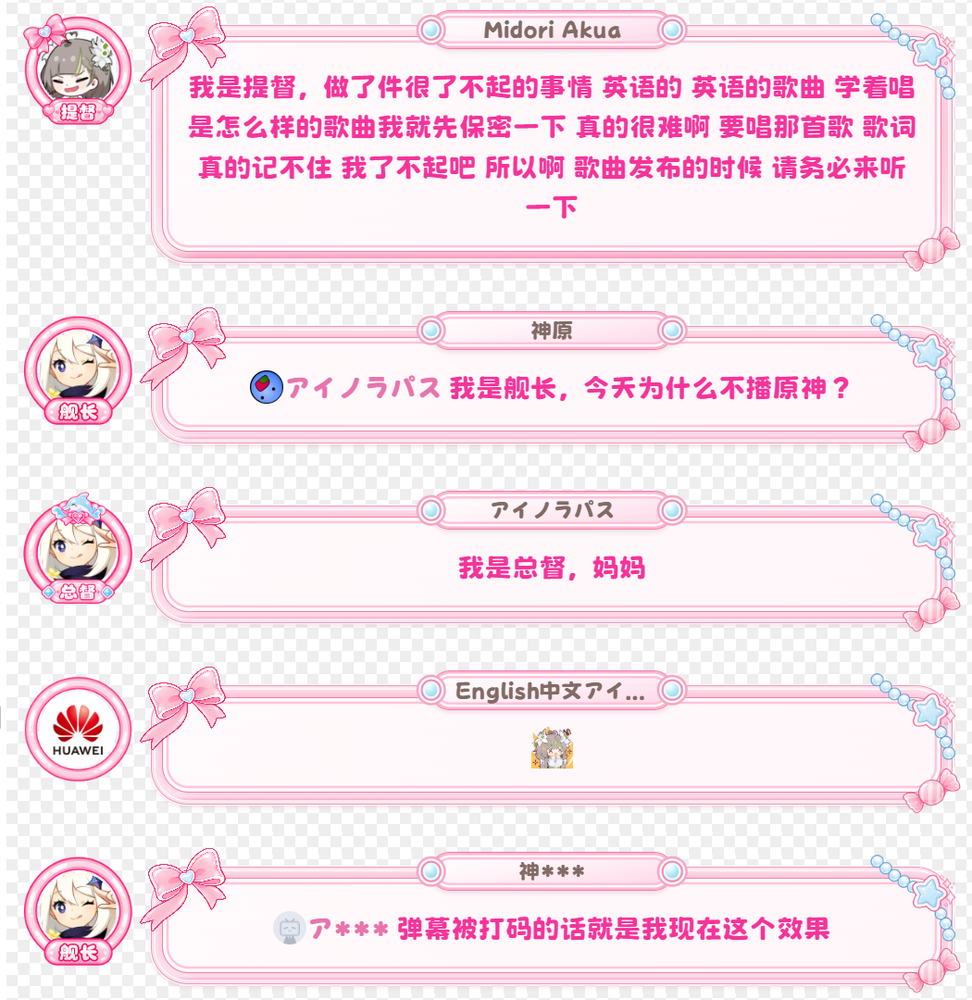

# 海豚也是豚 · dudu-pink-dolphin

LAPLACE Chat 的粉色弹幕样式：自适应正文框、顶部用户名名牌、荆南圆体中英日字体，以及按大航海等级切换的头像装饰框。

<p align="center">
  
</p>

## 特性

| 特性 | 说明 |
| --- | --- |
| 自适应气泡 | 正文框宽度随内容自适应，长文本自动换行；过长的用户名显示省略号 |
| 顶部名牌 | 用户名绑定真实昵称，居中悬浮在气泡上沿 |
| 大航海头像框 | 水友 / 舰长 / 提督 / 总督 四套头像装饰框自动切换 |
| 中英日字体 | 荆南圆体，覆盖简繁中文、英文与日文假名，回退 `Microsoft YaHei` / `Yu Gothic` / `Meiryo` |
| 进入动效 | 弹幕从左滑入并淡入；弹幕过快时平台自动停用动画，保证可读性 |
| 装饰角标 | 左上蝴蝶结、右上珠链、右下糖果 |

## 使用

### 方式一：远程模版（推荐）

在 LAPLACE Chat 的「样式 → 远程模版」中填入：

```
https://dudu-1304160106.cos.ap-guangzhou.myqcloud.com/dudu-pink-dolphin.css
```

样式会随版本自动更新，无需手动维护。

### 方式二：自定义 CSS

1. 打开 LAPLACE Chat「样式 → 高级 CSS 编辑器」
2. 粘贴 `dudu-pink-dolphin.css` 的内容
3. 复制到 OBS 浏览器源的「自定义 CSS」

> 仓库内的 CSS 使用**相对路径**引用素材，便于本地预览与二次分发。若要在编辑器或 OBS 中直接使用，请把 `./assets/...` 换成可 HTTPS 访问的绝对地址，并保持文件与 `assets/` 的相对位置不变。

## 可调参数

样式顶部集中了布局参数，改这里即可整体调整：

| 变量 | 默认值 | 说明 |
| --- | --- | --- |
| `--nameplate-scale` | `1` | 名牌及名字同步缩放（`0.9` 缩小 / `1.1` 放大） |
| `--nameplate-width` | `210px` | 名牌基础宽度，超出显示省略号 |
| `--avatar-frame-size` | `100px` | 头像装饰框尺寸 |
| `--avatar-picture-size` | `66%` | 框内头像直径 |
| `--avatar-offset-x` | `8px` | 头像水平位移（正数向右） |
| `--avatar-text-gap` | `5px` | 头像与正文框间距 |
| `--avatar-offset-y` | `12px` | 头像距本条顶部 |
| `--nameplate-offset-y` | `4px` | 名牌上下偏移（正数向下） |
| `--text-space-top` | `35px` | 正文上方留白 |
| `--text-space-bottom` | `30px` | 正文下方留白 |
| `--text-space-left` | `30px` | 正文左侧留白 |
| `--text-space-right` | `30px` | 正文右侧留白 |
| `--text-line-height` | `1.45` | 多行文字行距（无单位） |

配色：

| 部位 | 取值 |
| --- | --- |
| 弹幕正文 | `var(--color-pink-500, #f6339a)` —— 平台 SCAS 色盘，随配色方案自动调光 |
| 用户名 | `#826b65` —— 四个档位统一 |

## 目录结构

```
.
├── dudu-pink-dolphin.css    # 样式主文件（相对路径版）
└── assets/
    ├── preview.png          # 本 README 的预览图
    ├── bow.png              # 左上蝴蝶结
    ├── necklace.png         # 右上珠链
    ├── candy.png            # 右下糖果
    └── avatar/
        ├── base.png         # 水友
        ├── jz.png           # 舰长
        ├── td.png           # 提督
        └── zd.png           # 总督
```

## 字体

正文与用户名使用 **荆南圆体**（CSS 字体名 `KeinannMaruPOP`），支持简体中文、繁体中文、英文与日文，采用 SIL Open Font License 1.1，可免费商用。

CSS 通过顶部的 `@import` 从 [ZeoSeven Fonts](https://fonts.zeoseven.com/items/850/) 按需加载字体分包，需要能访问该字体服务；加载失败时自动回退到系统字体（`Microsoft YaHei` / `Yu Gothic` / `Meiryo`）。

[字体项目与授权](https://booth.pm/ja/items/7090983) · 若自行托管或随项目分发字体文件，应保留对应版本的版权声明及 OFL 许可证。

## 素材与授权

图片素材由项目委托方提供，随本项目保存为本地文件。仓库中的 CSS 不暴露原始图片地址；发布为远程模版时再回填可 HTTPS 访问的绝对地址。

## 更新记录

| 版本 | 变更 |
| --- | --- |
| 1.0.15 | 更新总督头像框 |
| 1.0.10 – 1.0.14 | 用户名配色迭代：先按大航海等级分色，后统一为 `#826b65` |
| 1.0.7 – 1.0.9 | 字体改为荆南圆体（ZeoSeven 在线分包），补充日文回退 |
| 1.0.4 – 1.0.6 | 弹幕正文按大航海等级配色，随后统一为平台 `pink-500` |
| 1.0.3 | 新增弹幕进入动效（左滑 + 淡入） |
| 1.0.0 – 1.0.2 | 首次发布：气泡、名牌、头像框与素材地址回填 |
